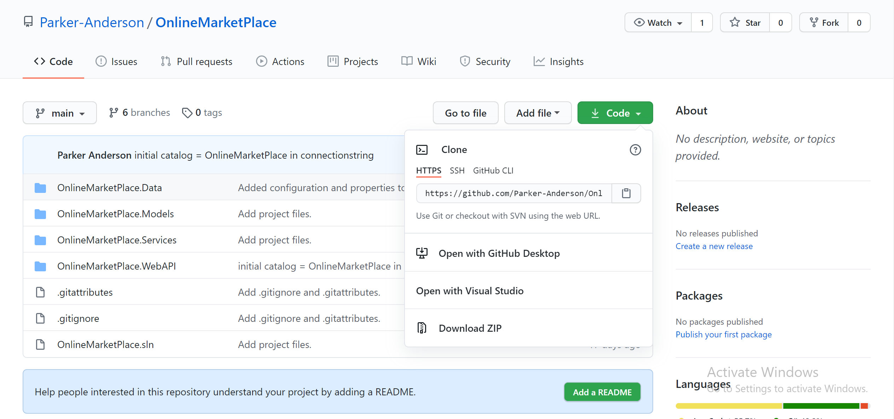
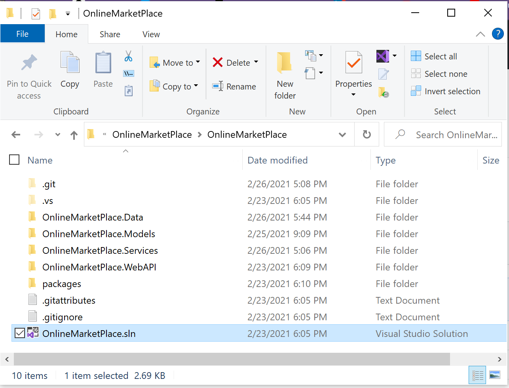
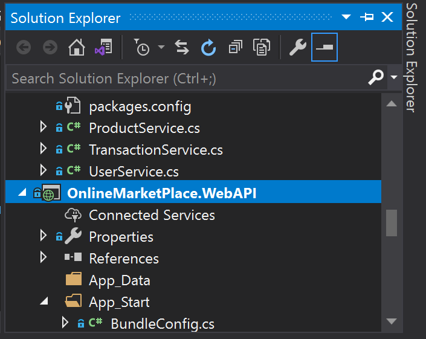
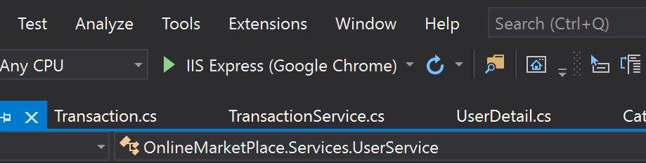

# _OnlineMarketPlace_
## _Project Description_
Online MarketPlace is an ASP.NET Web API designed to allow users to view, create, update and delete data for ecommerce functionality. This project was chosen because of an interest in ecommerce particularly because of the increased online presence during the pandemic.

## _Installation_
Follow the steps below to begin using the API
1. Make sure to have the latest version of [Visual Studio](https://visualstudio.microsoft.com/) installed
2. From the the [Main](https://github.com/Parker-Anderson/OnlineMarketPlace) branch you will be able to download the solution by selecting "Download Zip"

3. From there you can navigate to the solution and open it 

## _Using the Project_
To contribute to the project/access the API:
1. Make sure to have an API development program like [Postman](https://www.postman.com/) already installed
2. Open the solution explorer, right click "OnlineMarketPlace.WebAPI" and select "Set as Startup Project"

3. Run the program by selecting the play button at the top and you should be directed to the API page and have access to all of the endpoints

4. Now that you have access to the endpoints you can view and use them to create(post), read(get), upadate(put), and delete(delete) databases for the Online MarketPlace inside Visual Studio.
5. Choose the endpoint you wish to use and be sure to enter all the required fields in Postman.

## _Credentials and GitHubs_
- Mary Carole Scannnell
- Parker Anderson (https://github.com/Parker-Anderson)
- Tulha Alsalah 
- Seth Thomas (https://github.com/Seth-Thomas)

## _Resources_
- [Visual Studio](https://visualstudio.microsoft.com/)
- [Postman](https://www.postman.com/) 
- [GitHub](https://github.com/)
- [Stack Overflow](https://stackoverflow.com/questions/17127351/introducing-foreign-key-constraint-may-cause-cycles-or-multiple-cascade-paths) to address nullabel foreign keys
- 
